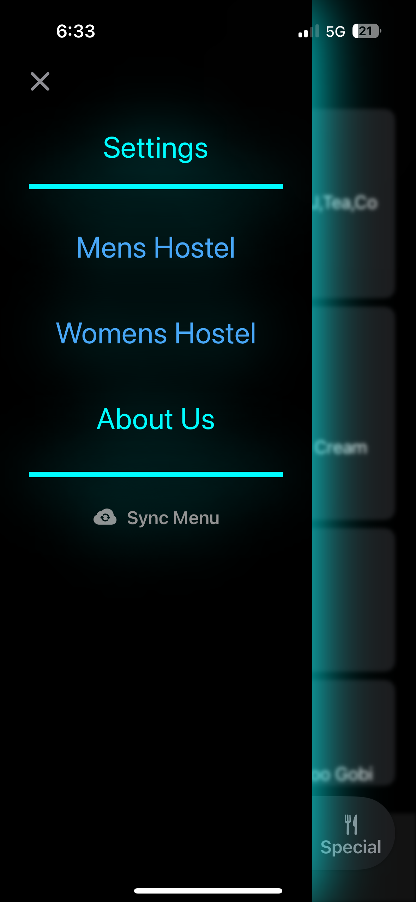
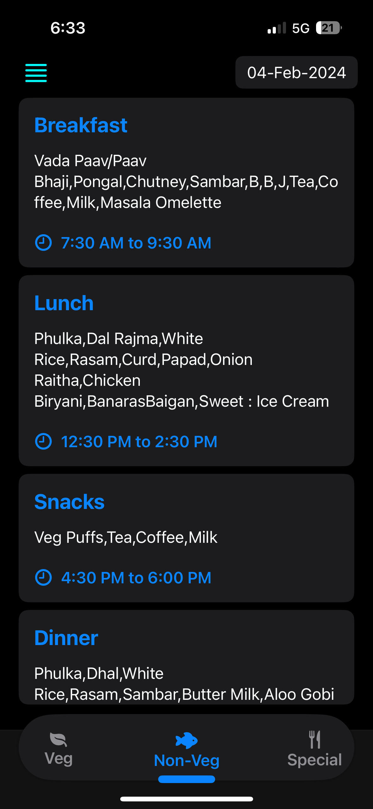

# 🍱 Nom Nom – Mess Menu App for Students

**Nom Nom** is a sleek and lightweight iOS app built with SwiftUI to help college students quickly check their daily mess menu. It displays meals in a clean, categorized layout — no more confusion or repeated questions about what’s being served!

## 📸 Screenshots

Here’s a preview of the Nom Nom iOS app:

<p float="left">
  
  
  
</p>

---

## 🎯 Features

- 🗓️ **Daily Menu View** – Instantly see what’s on the plate for breakfast, lunch, snacks, and dinner.
- 📅 **Weekly Menu Navigation** – Scroll through the weekly menu to plan your meals in advance.
- 🍽️ **Categorized Layout** – Meals are grouped neatly by time of day.
- 📱 **Minimal Design** – Focused on clarity, speed, and simplicity using SwiftUI.
- 🔄 **Easily Updatable** – Menu can be updated via a static JSON or connected backend (e.g. Supabase or Firebase).

---

## 🛠 Tech Stack

- `Swift` & `SwiftUI`
- `MVVM` Architecture
- JSON-based or backend menu data source (customizable)
- Designed for iPhone

---

## 🚀 Getting Started

1. Clone the repository:
   ```bash
   git clone https://github.com/Daipayan0p/Nom-Nom.git
